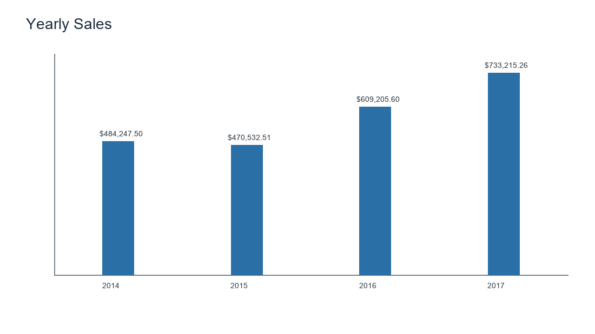
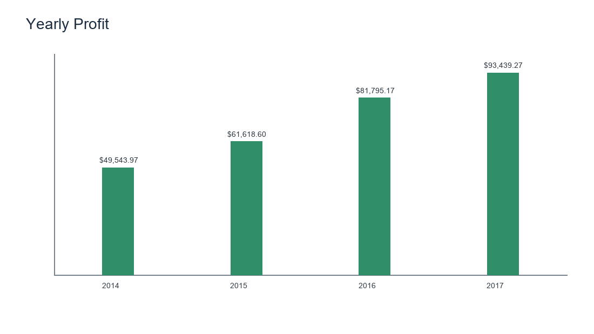
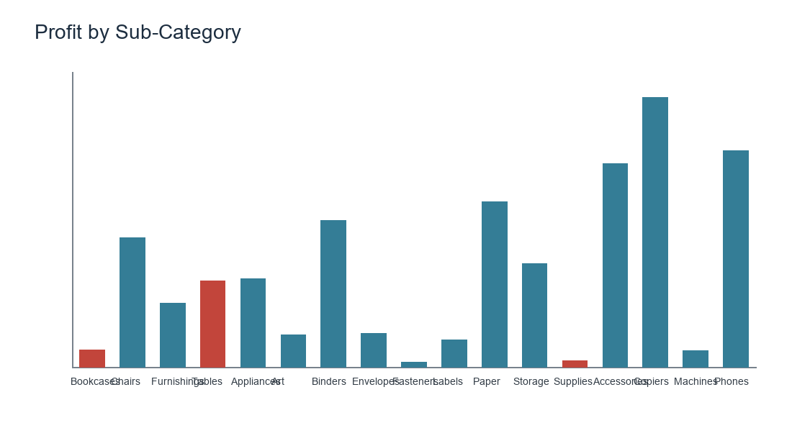
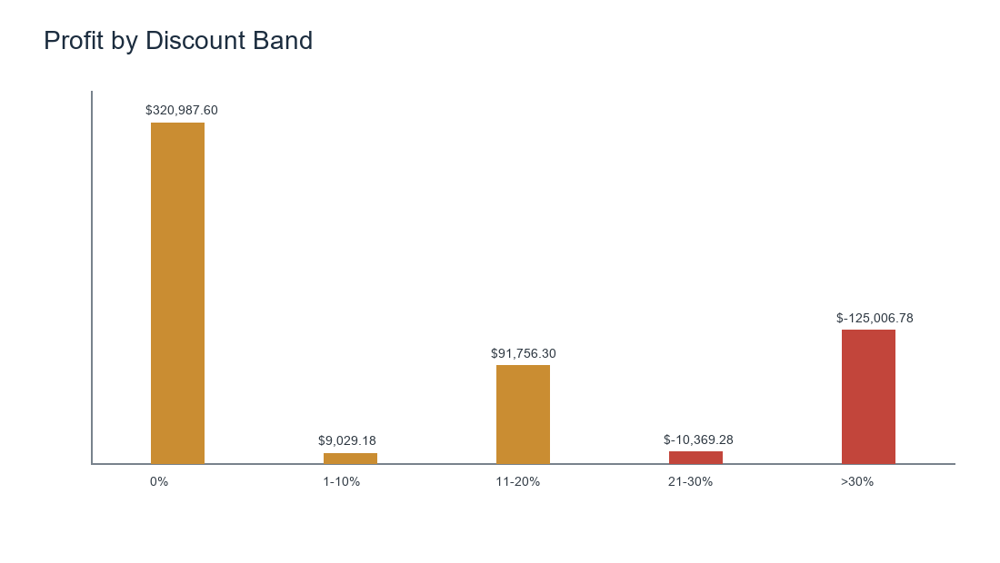
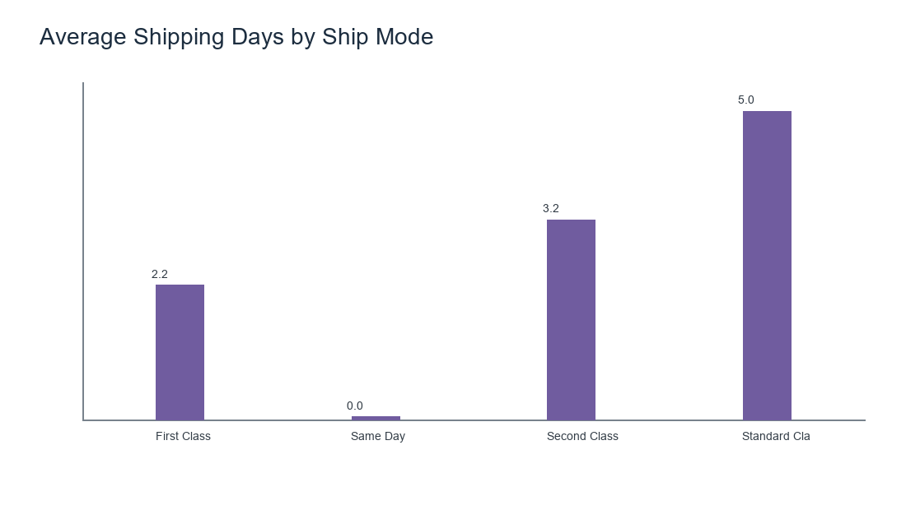
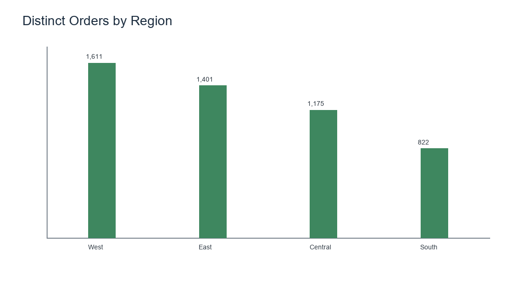
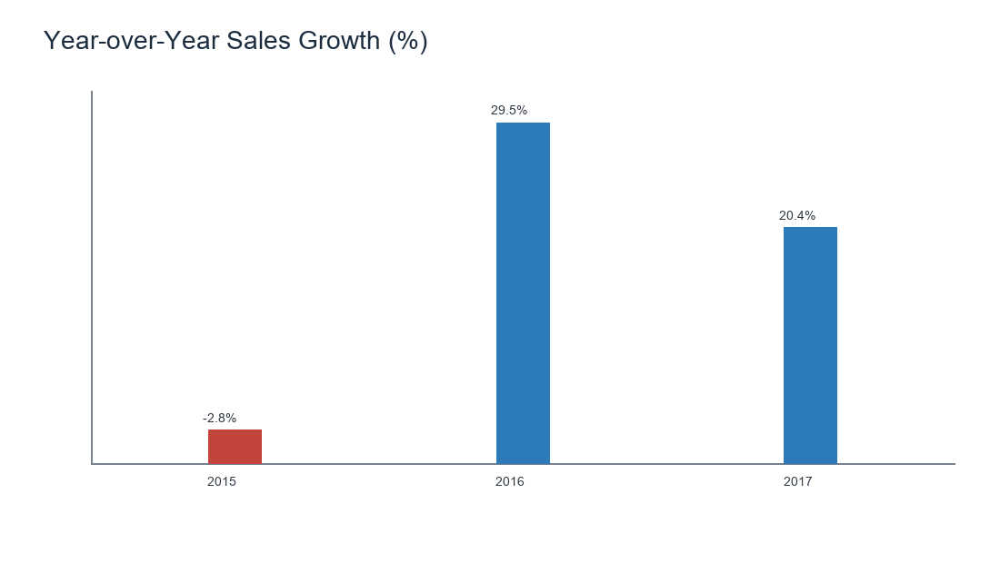

# E-Commerce Sales Analysis (Excel + SQL + Power BI)

## Charts at a glance








## Problem statement
Explore four years of Superstore order-line data to identify sales and profit trends, product/category performance, shipping patterns, discount outcomes, and regional/customer opportunities.

## Dataset
The original Superstore dataset supplied for this project is preserved under `data/raw/`. The analysis uses 9,994 order-line records spanning 2014–2017. A row represents a product line on an order; order counts therefore use distinct Order IDs. No data was fabricated.

## Tools
Python and pandas for cleaning and analysis; Excel formulas and native charts for the workbook; MySQL 8+ SQL with PostgreSQL notes; Power BI Desktop instructions and DAX. Charts are written as PNG using Pillow because matplotlib is not installed in the bundled runtime; the project data and chart values are real.

## Folder structure
```text
data/raw/       original CSV files (unchanged)
data/cleaned/   cleaned import-ready CSV
data/           clean_data.py and cleaning summaries
excel/          analysis workbook and PivotTable guide
sql/            schema, load steps, 12 queries, result checks
powerbi/        model/DAX/build notes and chart-ready CSVs
images/         generated PNG charts
```

## Business questions answered
- How did annual sales, profit, and order counts change?
- Which categories and sub-categories create or lose profit?
- How do discount levels relate to average and total profit?
- Which shipping modes are fastest on average?
- How do segments, regions, states, and customers compare?

## Methodology
`data/clean_data.py` trims text, standardizes column names, removes exact duplicates, parses dates, handles blanks, derives shipping days/year/month/margin/discount band, and writes a separate cleaned file. Summary tables are computed from that cleaned data. SQL queries use distinct order counts and window functions. Excel summaries use formulas rather than pretending to be PivotTables.

Cleaning summary: **9,994 rows before**, **0 duplicate rows removed**, **9,994 rows after**, and **0 missing cells handled**. See [`data/cleaning_summary.md`](data/cleaning_summary.md).

## Findings from this dataset
The strongest sales year was 2017, with $733,215.26 in sales and $93,439.27 in profit.
Copiers led category/sub-category profit at $55,617.82 (within Technology).
Tables had the lowest sub-category profit at $-17,725.48; review its pricing, discounting, and costs.
Same Day had the shortest average shipping time (0.04 days); Standard Class averaged 5.01 days.
Discount bands of 21% or higher produced $-135,376.06 combined profit across 1,393 rows.

The high-discount finding is descriptive association only; customer/order mix and product costs may also explain the observed profit.

## Recommendations
- Review discount approvals above 20%; compare incremental revenue and profit at product/order level before changing policy.
- Investigate loss-making sub-categories and Furniture discount outcomes with pricing and cost data.
- Use customer, region, and segment filters to prioritize follow-up analysis; do not infer causality from the summaries.
- Compare shipping speed with cost and customer satisfaction before changing fulfillment mode.

## How to run
From the project folder, run `python data/clean_data.py` with pandas and Pillow installed. Open `excel/ecommerce_sales_analysis.xlsx` in Excel. In MySQL Workbench, run `sql/01_schema.sql`, import the cleaned CSV using `sql/02_load_data.sql`, then run queries from `sql/03_analysis_queries.sql`. Follow `powerbi/dashboard_build_guide.md` to create the `.pbix` dashboard.

## Future improvements
- Add product cost, returns, and customer satisfaction data to measure drivers and net outcomes.
- Add automated refresh and a documented validation pipeline.
- Extend the forecast with holdout error metrics and compare simple baseline models.
- Build an interactive Power BI report and add a verified map.
